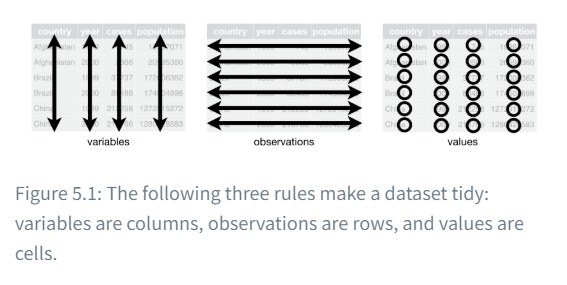
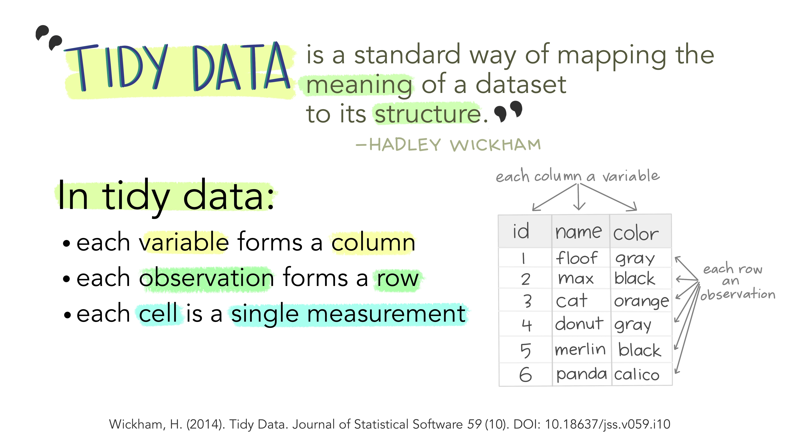
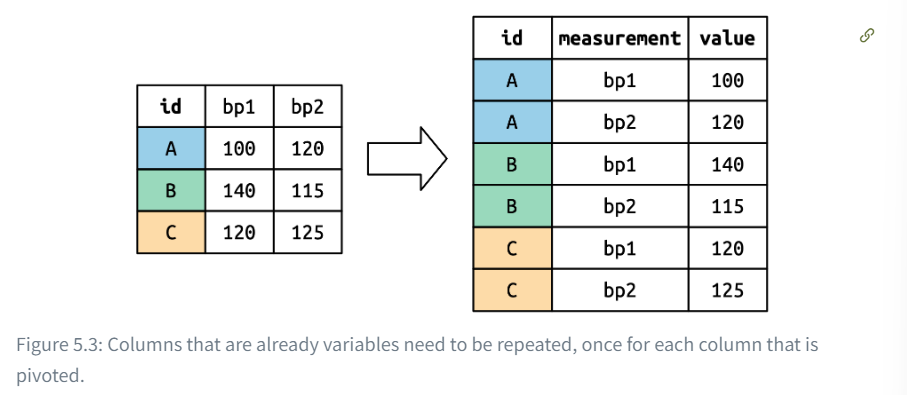
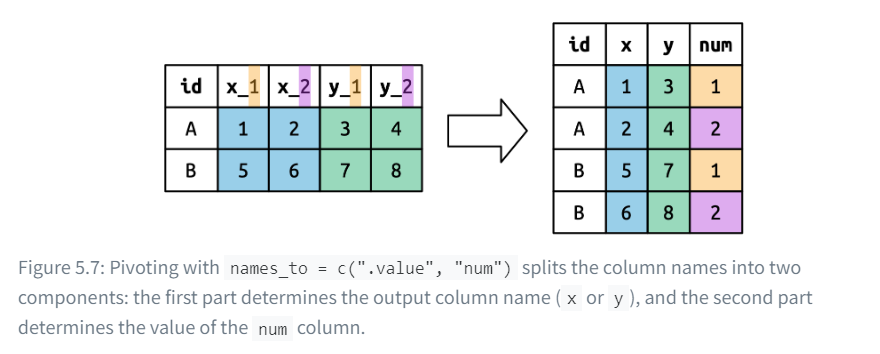



# Basic data transformation in `tidyverse`

## Materials needed

-   `library(dplyr)`

## Rows

First, load tidyverse:

```{r}
library(tidyverse)
```

Then, we need to load some data. We are going to load the flights data. This is what we are going to be using.

```{r}
library(nycflights13) 
head(flights)
```

### `filter()`

Next we can use the `filter()` command to filter out some of the data. Let’s say we want to filter out departure delay times greater than 1:

```{r}
flights %>%   
  filter(dep_delay > 1)
```

Or we can also add more than one filter. Let’s say we want to filter the depature delays \> 1 AND are coming from the JFK airport.

```{r}
flights %>%   
  filter(dep_delay > 1 & origin == "JFK")
```

You can also use “or” reasoning so a condition is **either one or the other.** Use the **straight line (\|)** for the “or” reasoning. Note that this yields more results than the and reasoning.

```{r}
flights %>%   
  filter(dep_delay > 1 | origin == "JFK") # either has a departure delay > 1 OR is coming from JFK
```

### `arrange()`

the `arrange()` command changes the order of the rows based on the value of the columns. For example, this one below arranges the year, month, and day by departure delay.

```{r}
flights %>%   
  arrange(year, month, day, dep_delay)
```

In this code below, the results are arranged by descending reaction time.

```{r}
flights %>%   
  arrange(desc(dep_delay))
```

### `distinct()` and `count()`

`distinct` finds all the unique rows in a data set and then primarily operates on those rows.

```{r}
flights %>%   
  distinct() # finds any duplicate values (if any) # looks like there are none!
```

Next we are going to find all the unique pairs of origin and destination.

```{r}
flights %>%   
  distinct(origin, dest)
```

Alternatively, **you can keep all the other columns using `.keep_all=TRUE`**.

```{r}
flights %>%   
  distinct(origin, dest, .keep_all=TRUE)
```

You can also use the `count()` command to find the number of occurrences instead.

```{r}
flights %>%   
  count(origin, dest, sort=TRUE)
```

## Columns

There are four functions we can use to change columns without affecting the rows.

-   `mutate()`

-   `select()`

-   `rename()`

-   `relocate`

### `mutate()`

First I’m going to use mutate. Mutate is used when you want to add new columns calculated from other ones. I want to add three new columns: `gain`, `hours`, and `gain_per_hr`.

```{r}
flights %>%   
  mutate(     
    gain = dep_delay - arr_delay,     
    hours = air_time / 60,     
    gain_per_hour = gain / hours,    
    .keep = "used" # indicates that I want to keep the columns I used in the function.   
    )
```

We can use `.before` and `.after` to put the columns before or after a specific column.

```{r}
flights %>%   
  mutate(     
    gain = dep_delay - arr_delay,     
    hours = air_time / 60,     
    gain_per_hour = gain / hours,     
    .before = 1   
    )
```

```{r}
flights %>%  
  mutate(     
    gain = dep_delay - arr_delay,     
    hours = air_time / 60,     
    gain_per_hour = gain / hours,     
    .after = 1   
    )
```

### `select()`

The next one we are going to go over is select. Select allows us to… well, select specific columns.

```{r}
flights %>%   
  select(year, month, day)
```

Selecting columns between specific columns using a colon.

```{r}
flights %>%   
  select(year:day)
```

Select all columns EXCEPT for those from year to day:

```{r}
flights %>%  
  select(!year:day)
```

Select columns that are just characters:

```{r}
flights %>%   
  select(where(is.character))
```

Here are some other helper functions:

-   `starts_with("abc")`: matches names that begin with “abc”.

-   `ends_with("xyz")`: matches names that end with “xyz”.

-   `contains("ijk")`: matches names that contain “ijk”.

-   `num_range("x", 1:3)`: matches x1, x2 and x3.

You can also rename variables using the equal sign:

```{r}
flights %>%   
  select(tail_num = tailnum)
```

### `rename()`

Rename is very straightforward. You can rename your variables within the table using the command with the equal sign.

```{r}
flights %>%   
  rename(tail_num = tailnum)
```

If you have a bunch of inconsistently named columns and it would be painful to fix them all by hand, check out `janitor::clean_names()`which provides some useful automated cleaning.

### `relocate()`

You can use relocate to, well, relocate variables within the table.

```{r}
flights %>%   
  relocate(time_hour, air_time)
```

You can also specify where to relocate them.

```{r}
flights %>%   
  relocate(     
    starts_with("J"), # relocates anything starting with J     
    .after = dep_time   
    )
```



## Grouping and Summarizing

### `group_by()`

The `group_by` function allows us to group data into groups meaningful for analysis.

```{r}
flights %>%
  group_by(month)
```

If you look at the top, you can see `Groups:month [12]` indicating that the output is “grouped by” month. So subsequent operations will now group by month.

### `summarize()`

the `summarize` function allows us to calculate a single summary statistic, which reduces the dataframe to have a single row for each group.

```{r}
flights %>%
  group_by(month) %>%
  summarize(
    avg_delay = mean(dep_delay, na.rm = TRUE) # make sure to get rid of NA values
  )
```

You can also use `n()` to return the number of rows in each group.

```{r}
flights %>%
  group_by(month) %>%
  summarize(
    avg_delay = mean(dep_delay, na.rm = TRUE), # make sure to get rid of NA values
    n = n()
  )
```



# Data tidying

## Materials needed

-   `library(tidyr)`

Since we already loaded tidyverse once, we don’t need to do it again, but we do need to use `tidyr` for this.

## Why tidy data?

There are two main advantages to tidying data.

1.  Consistency in storing data helps you learn the tools that work with it since they have an underlying uniformity
2.  Placing variables in columns allows R to work more naturally since you are working with vectors of values.





It turns raw, disorganized data into a structured format where every variable is a column, each observations is a row, and each observational unit is in a table. This saves time and enhances accuracy. It’s sort of like sorting food based on food group in your kitchen, so it is easier to access cook with them.

## Lengthening, widening, and pivoting data

### `pivot_longer()`

For this, we’re going to use the messy datasets. Note that messy ≠ missing data! Data can just be duplicated, miss titles, or have typos.

```{r}
billboard # load up the billboard dataset from the tidyr datasets
```

Next, we are going to use `pivot_longer()`. For this one, every observation is a single song. The first three columns (`artist`, `track`, `date.entered`) are variables that describe the song. Then we have 76 other columns, `wk1`-`wk76`, that describe the rank of each song for each week. However, since there so many columns as seen below, we are going to use `pivot_longer` organize the columns into values.

```{r}
billboard %>%
  pivot_longer(
    cols = starts_with("wk"), 
    names_to = "week", # organizes
    values_to = "rank" 
  )
```

In `pivot_longer()`, the function uses three arguments:

-   `cols` - specifies which columns need to be pivoted (in other words, which columns are NOT variables

    -   Uses the same syntax as `select()`

        -   e.g., could use `!c(artist, track, date.entered)` or `starts_with("wk")`

-   `names_to` - names the variable stored in the **column names**, we named that variable `week`.

-   `values_to` - names the variable stored in the **cell values**, we named that variable `rank`.

We can also use `values_drop_na` to get rid of the NA values.

```{r}
billboard %>%
  pivot_longer(
    cols = starts_with("wk"), 
    names_to = "week", # organizes
    values_to = "rank", 
    values_drop_na = TRUE
  )
```

The data is tidy now, BUT we could also parse the week numbers as actual numbers using `parse_number` in the mutate function. This will extract the numbers from a string.

```{r}
billboard %>%
  pivot_longer(
    cols = starts_with("wk"), 
    names_to = "week", # organizes
    values_to = "rank", 
    values_drop_na = TRUE
  ) %>%
  mutate(
    week = parse_number(week)
  )
```

#### How does `pivot_longer()` even work?

We are going to make a `tribble()` for this, so it’s easier to understand. Let’s say we have two trials in which participants’ sleep was recorded in a small experiment (in hrs):

```{r}
df <- tribble(
  ~name, ~sleep1, ~sleep2, 
  "Bob", 8.5, 8.2, 
  "Ted", 7.1, 7.5, 
  "Carol", 6.2, 7.1, 
  "Alice", 8.1, 8.7
)
df
```

We want our new dataset to have three variables, `name`, `trial`, and `duration (hrs)`.

```{r}
df %>% 
  pivot_longer(
    cols = c(sleep1, sleep2), 
    names_to = "trial", 
    values_to = "duration (hrs)"
  )
```

So in short it looks something like this:



#### Multiple variables

Having multiple variables can a be a bit more tricky. Let’s use the `who2` dataset for example:

```{r}
who2
```

This dataset covers tuberculosis diagnoses. We already have country and year, but the other ones are tricky. The “m” and “f” stand for male and female respectively, and the `sp`/`rel`/`ep` show the method of diagnosis.

So we are going to convert these to method of diagnosis, sex, and age.

```{r}
who2 %>%
  pivot_longer(
    cols = !c(country, year), 
    names_to = c("diagnosis", "sex", "age"), 
    names_sep = "_", # separates the words
    values_to = "count"
  )
```

#### Data and variable names in the column headers

Another tricky thing is when the column names include a mix of variable values and names. For example, look at the `household` dataset:

```{r}
household
```

Note how two of the columns contain two variables (`dob`, `name`) and the values of another (`child`, with values 1 or 2). We need to use the `.value` sentinel. This is where it tells pivot to override the usual `values_to` argument which uses the first component of the pivoted column name as a variable name.

```{r}
household %>%
  pivot_longer(
    cols = !family, 
    names_to = c(".value", "child"), # sseparate the dob from child 
    names_sep = "_", 
    values_drop_na = TRUE
  )
```

If it’s still confusing, it can be summarized this way:



### `pivot_wider()`

Right now we’ve used `pivot_longer()` to solve the issue of values ending up as column names. Next, we’ll use `pivot_wider`, which makes datasets wider by increasing columns and reducing rows. This is very common in governmental data. For example, lets use the `cms_patient_experience` dataset:

```{r}
cms_patient_experience
```

Notice how the organization is spread across six rows. Each row is for each measurement taken in the organization. We can see the complete set of values for `measure_cd` and `measure_title` by using `distinct()`:

```{r}
cms_patient_experience %>%
  distinct(measure_cd, measure_title)
```

Neither of these columns are good variable names. We’re going to use `measure_cd`, but in real analysis you need better, shorter names.

`pivot_wider()` has the opposite to `pivot_longer()`. So instead of choosing new column names, we provide existing columns that define the values and the column name.

```{r}
cms_patient_experience %>%
  pivot_wider(
    names_from = measure_cd, 
    values_from = prf_rate
  )
```

So in other words, it did something like this:


```{r}
cms_patient_experience %>%
  pivot_wider(
    id_cols = starts_with("org"), 
    names_from = measure_cd, 
    values_from = prf_rate
  )
```

```{r}
df <- tribble(
  ~name, ~trial, ~hrs, 
  "Bob","sleep1",8.5,	
  "Bob","sleep2",8.2,	
  "Ted","sleep1",7.1,
  "Ted","sleep2",7.5, 
  "Carol","sleep1",	6.2, 	
  "Carol","sleep2",7.1, 		
  "Alice","sleep1",8.1, 	
  "Alice","sleep2",8.7
)
df
```

So now that we have our table, we can take the values from the `hours` columns and the names from the `trial` column:

```{r}
df %>%
  pivot_wider(
    names_from = trial, 
    values_from = hrs
  )
```

 

